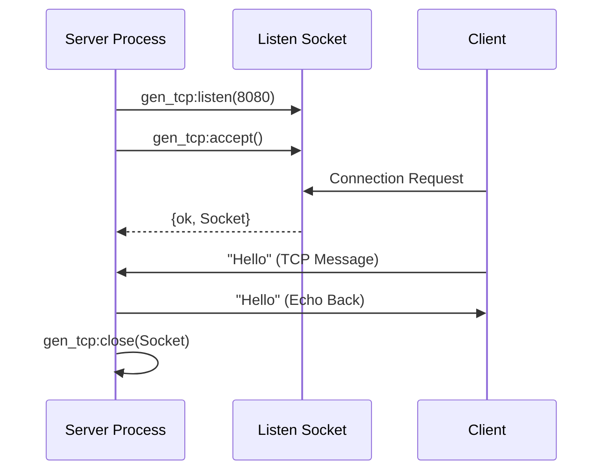

SHELL 1:

1> {ok, Socket} = gen_udp:open(8789, [binary, {active,true}]).
{ok,#Port<0.676>}
2> gen_udp:open(8789, [binary, {active,true}]).
{error,eaddrinuse}


SHELL 2:

1> {ok, Socket} = gen_udp:open(8790).
{ok,#Port<0.587>}
2> gen_udp:send(Socket, {127,0,0,1}, 8789, "hey there!").
ok


SHELL 1:

{ok, ListenSocket} = gen_tcp:listen(8091, [{active,true}, binary]).
{ok, AcceptSocket} = gen_tcp:accept(ListenSocket).

SHELL 2:
1> {ok, Socket} = gen_tcp:connect({127,0,0,1}, 8091, [binary, {active,true}]). 


SHELL 1:
{ok, Listen} = gen_tcp:listen(8088, [{active,false}]).
{ok, Accept} = gen_tcp:accept(Listen).

 inet:setopts(Accept, [{active, true}]).

 SHELL 2:
 {ok, Socket} = gen_tcp:connect({127,0,0,1}, 8088, []).
 gen_tcp:send(Socket, "hey there").


 # Erlang Sockets: A Visual Summary

Erlang manages network communication primarily through the `gen_tcp` (connection-oriented) and `gen_udp` (connectionless) modules.

## 1. TCP Lifecycle: Server vs. Client

TCP requires a "handshake" process. The server waits for connections, while the client initiates them.


| Role | Action | Command | Description |
| :--- | :--- | :--- | :--- |
| **Server** | **Listen** | `gen_tcp:listen(Port, Opts)` | Opens a "Listen Socket" to wait for callers. |
| **Server** | **Accept** | `gen_tcp:accept(LSock)` | Blocks until a client connects; returns a new "Accept Socket." |
| **Client** | **Connect**| `gen_tcp:connect(IP, Port, Opts)` | Attempts to reach a server. Returns a "Socket." |
| **Both** | **Transfer**| `gen_tcp:send(Sock, Bin)` | Sends data as a binary or list. |
| **Both** | **Close**  | `gen_tcp:close(Sock)` | Terminals the connection. |

---

## 2. Data Flow Control (The "Active" Modes)

Erlang allows you to decide how incoming data is delivered to your process. This is set in the `Opts` list (e.g., `[{active, once}]`).


| Mode | Behavior | Pros/Cons |
| :--- | :--- | :--- |
| **`{active, true}`** | Data is sent to your mailbox immediately as `{tcp, Socket, Data}`. | 🚀 Fast, but can crash your node if the sender floods you. |
| **`{active, false}`**| You must call `gen_tcp:recv(Socket, Length)` to pull data. | 🛡️ Safest (Passive); you control the speed, but it blocks the process. |
| **`{active, once}`** | You get **one** message, then the socket turns to `active, false`. | ⚖️ The "Golden Mean." You process one packet, then re-enable the socket. |

---

## 3. Process Ownership (Controlling Process)

In Erlang, a socket is "tied" to the PID that created it. Only that PID receives messages from the socket.

1.  **Acceptor Process:** Runs `gen_tcp:accept`.
2.  **Worker Process:** You spawn a new process to handle the client.
3.  **Handoff:** Use `gen_tcp:controlling_process(Socket, WorkerPid)` to move the socket to the new process.

---

## 4. Simple Echo Server Flow



---

## 5. TCP vs. UDP at a Glance

*   **TCP (`gen_tcp`):** Reliable, ordered, stream-oriented. Used for Web (HTTP), SSH, and Database connections.
*   **UDP (`gen_udp`):** Fast, unordered, packet-oriented. Used for Video streaming, Gaming, and DNS.
Use code with caution.


```erlang
-module(echo_server).
-export([start/1, acceptor/1, worker/1]).

%% 1. Start the server and create a 'Listen' socket
start(Port) ->
    {ok, LSock} = gen_tcp:listen(Port, [binary, {packet, 0}, {active, false}, {reuseaddr, true}]),
    io:format("Server listening on port ~p~n", [Port]),
    spawn(?MODULE, acceptor, [LSock]).

%% 2. Wait for a client connection
acceptor(LSock) ->
    {ok, Sock} = gen_tcp:accept(LSock),
    % Spawn a dedicated process for this specific client
    WorkerPid = spawn(?MODULE, worker, [Sock]),
    % Transfer socket ownership to the new worker process
    gen_tcp:controlling_process(Sock, WorkerPid),
    % Continue accepting other clients
    acceptor(LSock).

%% 3. Handle data in '{active, once}' mode
worker(Sock) ->
    % Enable 'once' mode to receive exactly one message
    inet:setopts(Sock, [{active, once}]),
    receive
        {tcp, Sock, Data} ->
            io:format("Received: ~p~n", [Data]),
            gen_tcp:send(Sock, Data), % Echo back
            worker(Sock);             % Loop and re-enable {active, once}
        {tcp_closed, Sock} ->
            io:format("Client disconnected~n");
        {tcp_error, Sock, Reason} ->
            io:format("Error: ~p~n", [Reason])
    end.
```

Compile and Start: In an Erlang shell, run c(echo_server). then echo_server:start(8080).
Connect: Open a terminal and use telnet localhost 8080 or nc localhost 8080.
Echo: Type anything; the server will send the exact text back to you.Would 